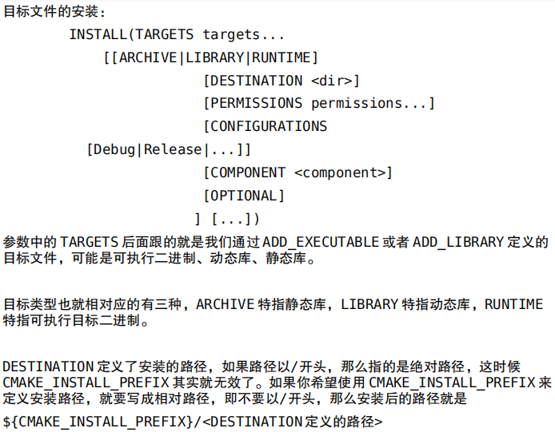

### PROJECT 指令的语法是：

PROJECT(projectname [CXX] [C] [Java])

这个指令隐式的定义了两个 cmake 变量:

<projectname>_BINARY_DIR 以及<projectname>_SOURCE_DIR

同时 cmake 系统也帮助我们预定义了 PROJECT_BINARY_DIR 和 PROJECT_SOURCE_DIR

变量，他们的值分别跟 HELLO_BINARY_DIR 与 HELLO_SOURCE_DIR 一致。 

了<projectname>_BINARY_DIR 和 PROJECT_BINARY_DIR 变量，他 

们指的编译发生的当前目录，如果是内部编译，就相当于PROJECT_SOURCE_DIR 也就是工程代码所在目录，如果是外部编译，指的是外部编译所在目录，也就是本例中的build目录。 

在哪里 ADD_EXECUTABLE 或 ADD_LIBRARY，如果需要改变目标存放路径，就在哪里加入上述的定义。

### SET 指令的语法是：

SET(VAR [VALUE] [CACHE TYPE DOCSTRING [FORCE]]) 

SET(SRC_LIST main.c t1.c t2.c)

### MESSAGE 指令的语法是：

MESSAGE([SEND_ERROR | STATUS | FATAL_ERROR] "message to display"

...)

### ADD_EXECUTABLE(hello ${SRC_LIST})

定义了这个工程会生成一个文件名为 hello 的可执行文件，相关的源文件是 SRC_LIST 中 

定义的源文件列表， 本例中你也可以直接写成 ADD_EXECUTABLE(hello main.c)

参数之间使用空格或分号分开

内部编译，直接cmake

外部编译，换个目录cmake

### ADD_SUBDIRECTORY 指令

ADD_SUBDIRECTORY(source_dir [binary_dir] [EXCLUDE_FROM_ALL])

这个指令用于向当前工程添加存放源文件的子目录，并可以指定中间二进制和目标二进制存 

放的位置。EXCLUDE_FROM_ALL 参数的含义是将这个目录从编译过程中排除，比如，工程 

的 example，可能就需要工程构建完成后，再进入 example 目录单独进行构建(当然，你 

也可以通过定义依赖来解决此类问题)。 

SUBDIRS(dir1 dir2...)，但是这个指令已经不推荐使用。它可以一次添加多个子目录， 并且，即使外部编译，子目录体系仍然会被保存

### 换个地方保存目标二进制

不包含编译生成的中间文件

SET(EXECUTABLE_OUTPUT_PATH ${PROJECT_BINARY_DIR}/bin)

SET(LIBRARY_OUTPUT_PATH ${PROJECT_BINARY_DIR}/lib)

### 安装

INSTALL ：定义安装规则，安装的内容包括目标二进制，动态库，静态库以及文件、目录、脚本等。

CMAKE_INSTALL_PREFIX：路径，默认定义是/usr/local

cmake -DCMAKE_INSTALL_PREFIX=/usr .

### ADD_LIBRARY
ADD_LIBRARY(libname [SHARED|STATIC|MODULE] [EXCLUDE_FROM_ALL] source1 source2 ... sourceN)

ADD_LIBRARY(hello SHARED ${LIBHELLO_SRC})
ADD_LIBRARY(hello STATIC ${LIBHELLO_SRC})
并不会同时生成，target是不允许重名的，改target的名字是非常蠢的
这时候需要另外一个指令

### SET_TARGET_PROPERTIES
重定义名字，定义版本号
SET_TARGET_PROPERTIES(target1 target2 ... PROPERTIES prop1 value1 prop2 value2 ...)

cmake 在构建一个新的 target 时,会尝试清理掉其他使用这个名字的库
SET_TARGET_PROPERTIES(hello PROPERTIES VERSION 1.2 SOVERSION 1)
VERSION 指代动态库版本,SOVERSION 指代 API 版本

### INCLUDE_DIRECTORIES
INCLUDE_DIRECTORIES([AFTER|BEFORE] [SYSTEM] dir1 dir2 ...)
增加头文件的目录

### LINK_DIRECTORIES
### TARGET_LINK_LIBRARIES
LINK_DIRECTORIES(dir1, dir2)添加非标准的共享库搜索路径

TARGET_LINK_LIBRARIES(target lib <debug | optimized> lib2 ...)
这个指令可以用来为target添加需要链接的共享库，本利中是一个可执行文件，但同样可以用于为自己编写的共享库添加共享库链接

https://blog.csdn.net/cdemtronix/article/details/82021227